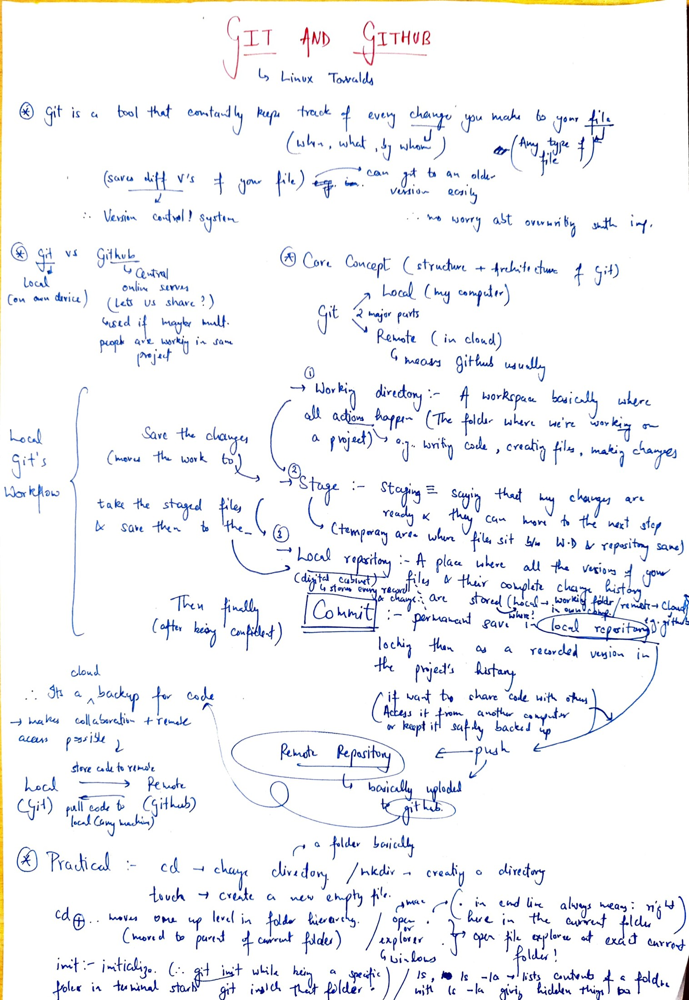
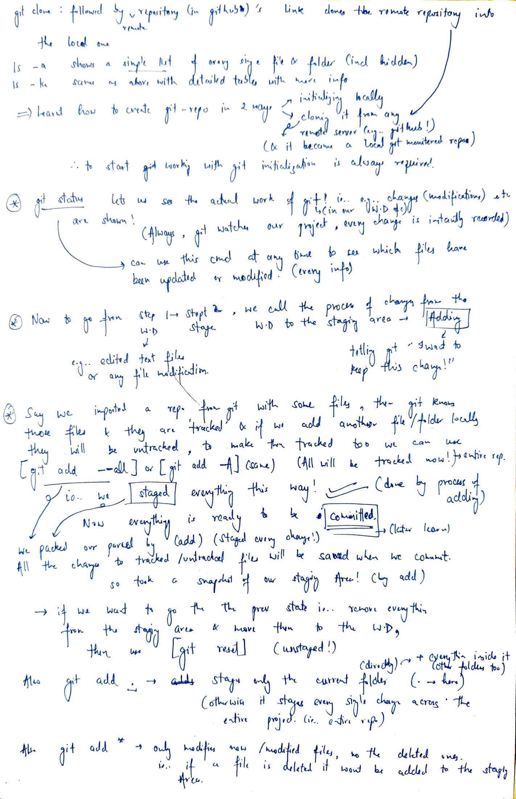
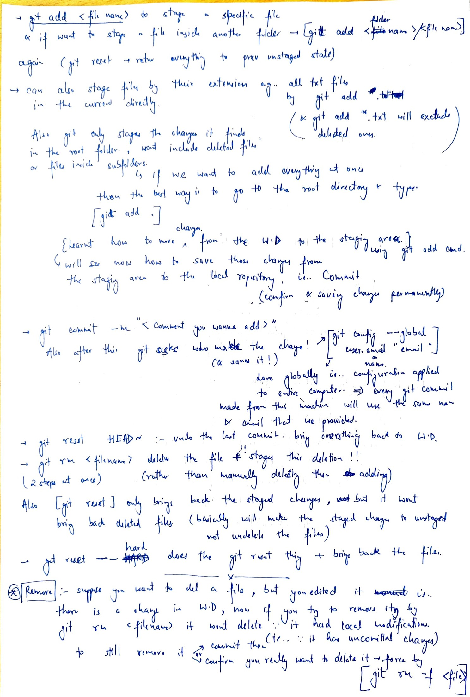
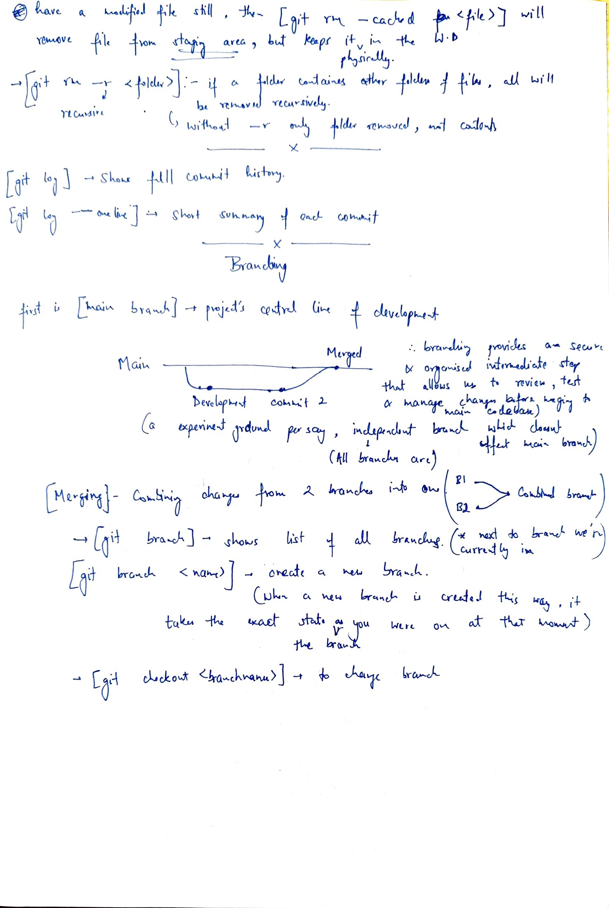

###Day 1: Git and GitHub basics Part 1
Here are my handwritten git and github basics notes and Comments for today:
I finally found out what Git anf GitHub actually is (had only heard a lot about it from tech people)
Learnt Git and GitHub purpose and distinction, basically git is a tool that lets you have save point in your work and github is the same but instead of Local its global letting us share the work as well as have other collaborators seamlessly edit the Work
Learnt the Structure and Architecture of Git, Local Git workflow (Working Directory to Stage to Local Repository (via Commit)) 
Learnt a Lot of commands for using Git by Bash, and a lot more, understood things like cloning from global to local repo, made the first ever repository of mine, understood other things like adding, resetting, removing, branching
Page 1:

Page 2:

Page 3:

Page 4:

